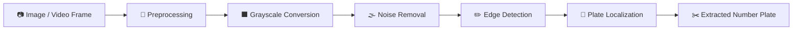

<table width="100%">
<tr>
<td width="15%" align="center">

</td>
<td width="70%" align="center">

</td>
<td width="15%" align="center">

</td>
</tr>
</table>

<div align="center">

<h3>Detecting Vehicle License Plates with Python and OpenCV</h3>


<br/>

<a href="https://github.com/shahrishabh1513-jsk/vehicle-number-plate-detection/blob/main/Vehicle_Number_Plate_Detection_Project_Report.pdf"></a>
<a href="https://github.com/shahrishabh1513-jsk/vehicle-number-plate-detection/blob/main/Number_plate_detection_FINAL.ipynb"></a>
<a href="https://github.com/shahrishabh1513-jsk/vehicle-number-plate-detection"></a>

<br/>


<br/>


</div>

<br/>

<table align="center">
<tr>
<td align="center" width="25%"><sub>LANGUAGE</sub><br><b>Python</b></td>
<td align="center" width="25%"><sub>LIBRARY</sub><br><b>OpenCV</b></td>
<td align="center" width="25%"><sub>INPUT</sub><br><b>Images · Video Frames</b></td>
<td align="center" width="25%"><sub>DELIVERABLES</sub><br><b>Notebook + PDF Report</b></td>
</tr>
</table>

<div align="center">

[](#-preview)
[](#-about-the-project)
[](#-key-features)
[](#-detection-pipeline)
[](#️-tech-stack)
[](#-folder-structure)
[](#-getting-started)
[](#-connect)

</div>

<div align="center"></div>

## 🔍 Preview

<div align="center">

<a href="https://github.com/shahrishabh1513-jsk/vehicle-number-plate-detection" target="_blank">

</a>

<br/>

<a href="https://github.com/shahrishabh1513-jsk/vehicle-number-plate-detection/blob/main/Vehicle_Number_Plate_Detection_Project_Report.pdf"></a>
<a href="https://github.com/shahrishabh1513-jsk/vehicle-number-plate-detection/blob/main/Number_plate_detection_FINAL.ipynb"></a>

</div>

<div align="center"></div>

## 📖 About The Project

**Vehicle Number Plate Detection** is a computer-vision project built with **Python and OpenCV**. It processes images or video frames and detects and extracts vehicle license plates by working through a classic image-processing pipeline: **image preprocessing, grayscale conversion, noise removal, edge detection, and plate localization**.

The full source lives in a single Jupyter notebook, and the methodology, steps and findings are documented in a separate **project report (PDF)**.

<div align="center">

| | |
|---|---|
| 🚗 **Type** | Computer-vision / image-processing project |
| 🎯 **Goal** | Detect and extract vehicle license plates from images or video frames |
| 🧰 **Built With** | Python · OpenCV · Jupyter Notebook |
| 📄 **Documentation** | Complete project report included as a PDF |

</div>

<div align="center"></div>

## ✨ Key Features

<table>
<tr>
<td width="50%" valign="top">

### 🖼️ Input Handling
- 📷 Works on **images** of vehicles
- 🎞️ Works on **video frames**
- 🔁 Same pipeline applied to each frame or image

</td>
<td width="50%" valign="top">

### 🧪 Image Processing
- 🔧 **Image preprocessing** to prepare each input
- ⬛ **Grayscale conversion** to simplify the image
- 🌫️ **Noise removal** to clean up the picture

</td>
</tr>
<tr>
<td width="50%" valign="top">

### 🔲 Detection
- ✏️ **Edge detection** to find object outlines
- 📍 **Plate localization** to find the plate region
- ✂️ **Plate extraction** from the original image

</td>
<td width="50%" valign="top">

### 📚 Documentation
- 📒 Full working code in one **Jupyter notebook**
- 📄 Detailed **PDF project report**
- 🧭 Step-by-step pipeline you can follow and modify

</td>
</tr>
</table>

<div align="center"></div>

## 🧭 Detection Pipeline



<div align="center">

| Stage | What it does |
|:---:|---|
| 🔧 **Preprocessing** | Prepares the input image or frame for analysis |
| ⬛ **Grayscale** | Drops colour information so edges are easier to find |
| 🌫️ **Noise removal** | Smooths the image so stray detail isn't mistaken for edges |
| ✏️ **Edge detection** | Highlights the outlines of the vehicle and its plate |
| 📍 **Localization** | Picks out the region that looks like a license plate |
| ✂️ **Extraction** | Crops the detected plate out of the original image |

</div>

<div align="center"></div>

## 🛠️ Tech Stack

<div align="center">

| Category | Technology | Purpose |
|:---:|:---:|:---|
| **Language** |  | Core programming language |
| **Computer Vision** |  | Image processing & plate detection |
| **Environment** |  | Notebook-based development |
| **Version Control** |   | Source control |

</div>

<div align="center"></div>

## 📂 Folder Structure

```bash
vehicle-number-plate-detection/
│
├── Number_plate_detection_FINAL.ipynb                 
├── Vehicle_Number_Plate_Detection_Project_Report.pdf   
└── README.md                                          
```

<div align="center"></div>

## 🚀 Getting Started

```bash
# 1️⃣ Clone the repository
git clone https://github.com/shahrishabh1513-jsk/vehicle-number-plate-detection.git

# 2️⃣ Move into the project folder
cd vehicle-number-plate-detection

# 3️⃣ Install the usual dependencies
pip install opencv-python numpy matplotlib jupyter

# 4️⃣ Launch the notebook
jupyter notebook Number_plate_detection_FINAL.ipynb
```

> 💡 The install line lists the typical packages for an OpenCV notebook — check the imports in the notebook's first cell for the exact list. You'll also need a vehicle image (or video) of your own to run the pipeline on.

<div align="center"></div>

## 🧭 Roadmap

- [x] Preprocessing, grayscale conversion & noise removal
- [x] Edge detection & plate localization
- [x] Full project report (PDF)
- [ ] 🔤 Read the plate text with OCR
- [ ] 🎥 Run on live camera or video streams
- [ ] 🌐 Wrap it in a simple web app
- [ ] 📊 Benchmark accuracy on a larger set of images

<div align="center"></div>

## 🤝 Connect

<div align="center">

**Rishabh Alpeshabhai Shah**

<a href="https://rishabh-shah-portfolio.netlify.app/"></a>
<a href="https://www.linkedin.com/in/rishabh-alpeshabhai-shah-91b9072a6/"></a>
<a href="mailto:shahrishu1515@gmail.com"></a>
<a href="https://github.com/shahrishabh1513-jsk"></a>

</div>

---

<div align="center">

### ⭐ If you found this project useful, consider giving it a star!


<br/>

**Made with 🚗 & 🐍 by Rishabh Shah**


</div>
